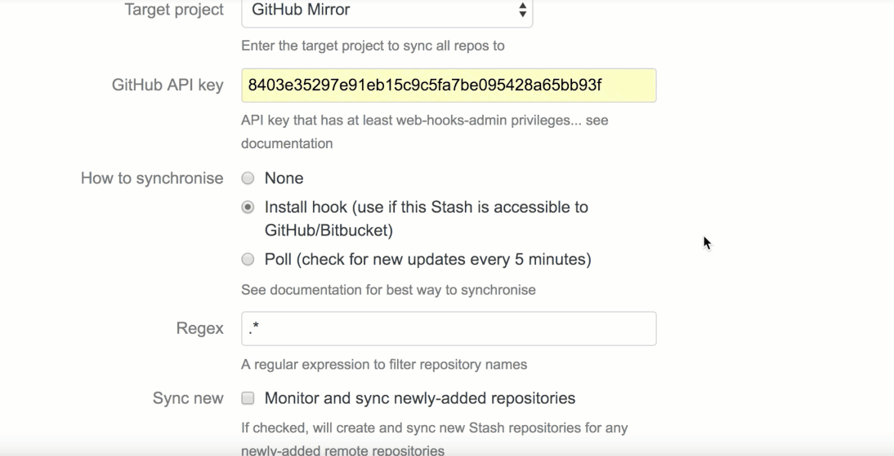

# RATIONALE #

* A kind of safeguard, lighthouse in the sea of bits of procedures and good practices to elicit our Bitbucket and GitHub's repositories. This is a vice-versa road where there is no left and rights, but there is ~~no~~ synergy between both
* This repo is a living document that will grow and adapt over time

### What is this repository for? ###

* Quick summary
    - Bitbucket to GiHhub checklist, _mostly_ for internal use
      
	  
    

### How do I get set up? ###

* Summary of set up
    - Check [`checklist.md`](checklist.md)
* Configuration
    - Needs that both Bitbucket and Github accounts (previously created) and authenticated by both service providers. Check our [previous checklist](https://bitbucket.org/imhicihu/setting-up-github-under-proxy/src/8c4fd4610fe0489b1fb642561a0e8e8ffb9ff863/Github_desktop_app_installation.md) to install Github app under a proxy-umbrella
* Dependencies
    - No dependencies declared
* Database configuration
    - There is no database involved
* Deployment instructions
    - Verify the steps to be done from our [`checklist.md`](checklist.md)
    - Install the [native app](https://desktop.github.com/) (according your operating system)
    - Once installed, follow this [guidelines](https://bitbucket.org/imhicihu/setting-up-github-under-proxy/src/master/Github_desktop_app_installation.md) to be proefficient inside our working environment, _aka_ under our proxy server

### Related repositories ###

* Some repositories linked with this project:
     - [Setting up github under proxy](https://bitbucket.org/imhicihu/setting-up-github-under-proxy/)
     - [Good practices on repository creation](https://bitbucket.org/imhicihu/good-practices-on-repository-creation/src/)

### Source ###

* Check them on [here](https://bitbucket.org/imhicihu/github-transfers/src)

### Issues ###

* Check them on [here](https://bitbucket.org/imhicihu/github-transfers/issues)

### Changelog ###

* Please check the [Commits](https://bitbucket.org/imhicihu/github-transfers/commits/) section for the current status

### Code of Conduct

* Please, check our [Code of Conduct](code_of_conduct.md)

### Legal ###

* All trademarks are the property of their respective owners.

### License ###

* The content of this project itself is licensed under the  
